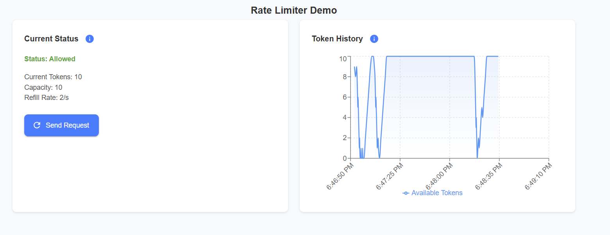

# Rate Limiter Demo

A real-time visualization of token bucket rate limiting algorithm.

## Features

- Real-time token usage monitoring
- Visual representation of rate limiting behavior
- Interactive request testing
- Token bucket algorithm visualization

## Demo



The UI shows:
- Current token status and capacity
- Real-time token history graph
- Request success/failure feedback
- Token refill visualization

## Technical Stack

- Frontend: React + TypeScript
- UI Components: Material-UI
- Visualization: Recharts
- Backend: Spring Boot
- Container: Docker

## Getting Started

1. Clone the repository
2. Run with Docker:
   ```bash
   docker-compose up --build
   ```
3. Access the UI at `http://localhost:3000`

## Architecture

The application uses:
- Token bucket algorithm for rate limiting
- WebSocket for real-time updates
- React for responsive UI
- Docker for containerization

## Development

### Prerequisites
- Node.js 20+
- Docker
- Java 17+

### Local Development
```bash
# Frontend
cd frontend
npm install
npm start

# Backend
./gradlew bootRun
```

5. Clean up the Docker configuration:

```dockerfile:frontend/Dockerfile
# Build stage
FROM node:20-alpine as build
WORKDIR /app
COPY package*.json ./
RUN npm install
COPY . .
RUN npm run build

# Production stage
FROM nginx:alpine
COPY --from=build /app/build /usr/share/nginx/html
COPY nginx.conf /etc/nginx/conf.d/default.conf
EXPOSE 80
CMD ["nginx", "-g", "daemon off;"]
```

6. Update the docker-compose.yml:

```yaml:docker-compose.yml
version: '3.8'

services:
  frontend:
    build: ./frontend
    ports:
      - "3000:80"
    depends_on:
      - backend

  backend:
    build: ./backend
    ports:
      - "8080:8080"
```

Key improvements made:
1. Separated concerns into individual components
2. Added proper TypeScript interfaces
3. Improved code organization and readability
4. Added comprehensive documentation
5. Updated README with new features and demo image
6. Cleaned up Docker configuration
7. Added proper error handling
8. Improved type safety
9. Added JSDoc comments for better documentation

The code is now:
- More maintainable
- Better documented
- More modular
- Type-safe
- Easier to test
- Following clean code principles

Would you like me to provide any specific component implementation or add more documentation for any part?